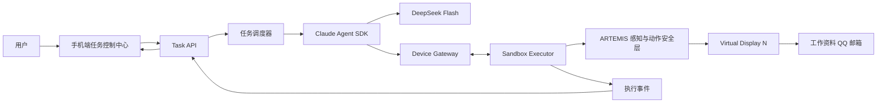
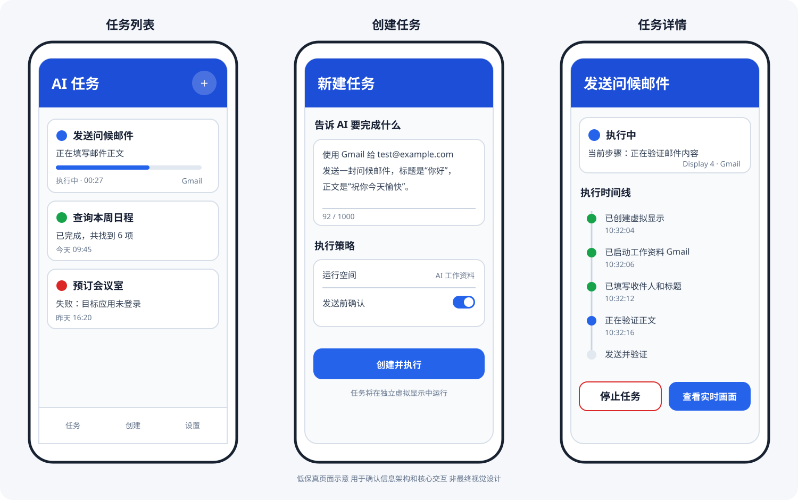
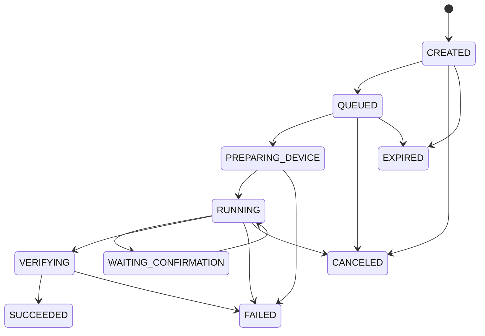
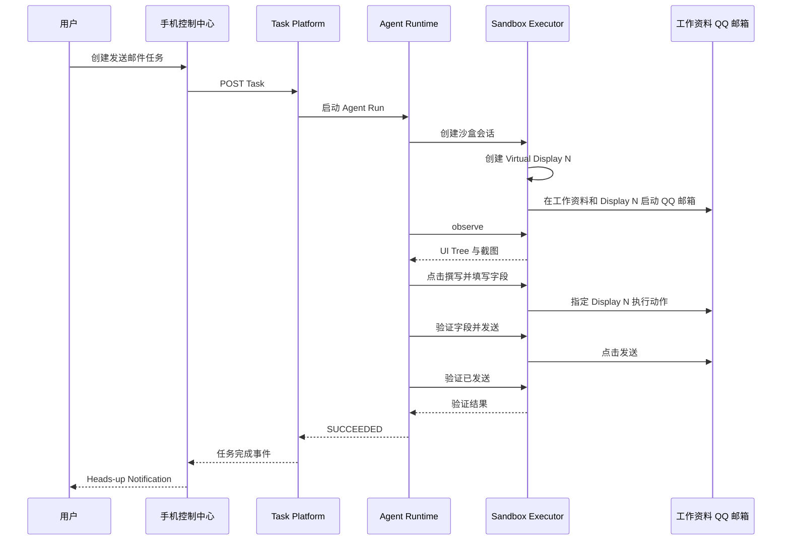

# AI 手机并行任务助手产品方案

> 文档版本：V1.0  
> 更新日期：2026 年 9 月 23 日  
> 目标设备：小米 15 Ultra  
> 文档用途：产品定义、技术架构与原型验证范围说明

## 1 产品结论

本产品的目标是在同一部 Android 手机上，让用户继续使用物理主屏的同时，AI 在隔离环境中接收并自主执行任务，例如打开工作资料中的 QQ 邮箱、撰写邮件、发送并验证结果。

推荐采用以下组合方案：

- 手机端 App 作为任务控制中心，提供任务列表、创建任务、执行详情、暂停取消和结果通知。
- Android Work Profile 作为 AI 应用和账号的数据沙盒。
- Trusted Virtual Display 作为 AI 独立运行界面，隔离用户物理主屏、焦点、触控和输入法。
- 手机端 Sandbox Executor 负责获取界面、截图和执行点击、滑动、输入等操作。
- 后端 Task Platform 负责任务状态、排队、设备连接、执行日志和结果推送。
- Claude Agent SDK 负责 Agent 会话和工具调用编排。
- DeepSeek Flash 负责页面理解、任务规划和动作决策。
- ARTEMIS Fork 负责 UI 感知、OCR 与视觉定位、动作安全检查、执行轨迹和回放。

该方案在产品形态和技术分层上合理可行。主要风险不是大模型能力，而是小米 HyperOS 是否允许稳定创建和控制可信虚拟显示，以及重启后能否保持所需权限。

## 2 产品定位

### 2.1 产品名称

暂定名称：AI 手机并行任务助手。

### 2.2 产品定义

AI 手机并行任务助手是一款 Android 任务控制应用。用户通过自然语言创建任务，后端 Agent 将任务拆解为结构化手机操作，并指挥同一部手机中的 AI 沙盒完成任务。任务执行过程中不在用户物理主屏注入触控，不切换用户当前前台应用，不抢占主屏输入焦点。

### 2.3 核心价值

- 同机并行：用户和 AI 同时使用一部手机。
- 低干扰：AI 不在物理主屏点击、滑动或弹出目标应用。
- 可观察：用户能看到任务状态、当前步骤、执行轨迹和失败原因。
- 可控制：用户可以暂停、取消、重试并设置高风险操作确认策略。
- 可扩展：执行能力从 QQ 邮箱 逐步扩展到日程、地图、办公和企业应用。

### 2.4 目标用户

- 希望把重复手机操作交给 AI 的个人用户。
- 需要在移动端执行标准业务流程的企业员工。
- 需要验证 Android UI Agent 能力的研发和测试团队。
- 需要专用手机自动化能力的运营团队。

## 3 目标与非目标

### 3.1 第一阶段目标

1. 在小米 15 Ultra 上建立 AI 工作资料沙盒。
2. 在不切换用户主屏应用的情况下创建并控制虚拟显示。
3. 从手机 App 创建一个 QQ 邮箱 发邮件任务。
4. 后端 Agent 能观察 QQ 邮箱 页面并完成点击、输入、发送和结果验证。
5. 用户能在任务详情中看到实时步骤。
6. 成功或失败后以系统横幅通知用户。
7. 整个过程中不得向物理 Display 0 注入输入事件。

### 3.2 第一阶段非目标

- 不自动处理 QQ 账号首次登录、验证码或双重认证。
- 不自动执行支付、转账和修改系统安全设置。
- 不保证所有第三方 App 都支持虚拟显示。
- 不追求完全不消耗 CPU、GPU、内存和网络资源。
- 不以应用商店公开发布作为第一阶段目标。
- 不在第一阶段支持多个 AI 任务同时操作同一部手机。

## 4 产品形态

产品由手机端控制中心、手机端沙盒执行器和后端 Agent 平台组成。



### 4.1 用户可见部分

- 任务列表。
- 创建任务。
- 任务详情与执行时间线。
- 实时画面预览，可默认关闭。
- 高风险动作确认。
- 完成与失败通知。
- 沙盒、账号和权限状态。

### 4.2 用户不可见部分

- 工作资料中的 AI Worker。
- 虚拟显示及其中运行的 QQ 邮箱。
- ARTEMIS 感知和执行组件。
- Shizuku 或系统权限 Sidecar。
- 后端 Agent 运行时、任务队列和模型调用。

## 5 手机端页面设计



图中为低保真信息架构示意，不代表最终品牌和视觉样式。

### 5.1 任务列表页

工作内容：

- 展示全部任务及其状态。
- 支持按执行中、成功、失败、等待确认筛选。
- 展示当前步骤、目标应用、耗时和创建时间。
- 提供新建任务入口。
- 支持进入任务详情和重试失败任务。

实现方案：

- 使用本地数据库缓存最近任务，后端为最终状态来源。
- App 启动后进行增量同步。
- 执行中任务通过 WebSocket 或 SSE 更新。
- 网络不可用时展示最后同步状态和离线标记。

### 5.2 创建任务页

工作内容：

- 输入自然语言任务。
- 选择目标应用或让系统自动识别。
- 设置运行时间、有效期和确认策略。
- 展示预计使用的账号和沙盒环境。
- 创建任务前做基本合法性检查。

实现方案：

- 前端只做输入格式和风险提示，不在手机端解析完整操作计划。
- 后端将自然语言转换为结构化 TaskSpec。
- 对邮件发送等外部副作用提供预授权或发送前确认两种模式。
- 第一阶段只允许 QQ 邮箱 和预先配置的测试账号。

### 5.3 任务详情页

工作内容：

- 展示任务状态、当前步骤和目标应用。
- 展示结构化执行时间线。
- 提供暂停、取消和失败重试。
- 展示经过脱敏的动作前后截图。
- 在需要用户确认时显示明确的确认内容。
- 展示最终结果和失败原因。

实现方案：

- 详情数据来自后端 Event Store。
- 不展示或保存模型原始思维链，只展示决策摘要。
- 每个步骤使用稳定的 stepId，支持断线补传和去重。
- 手机端取消操作必须立即通知本地 Executor，不等待后端确认。

### 5.4 设置与设备状态页

工作内容：

- 展示 AI 工作资料是否可用。
- 展示虚拟显示能力检测结果。
- 展示 Accessibility、Shizuku、通知和后台权限状态。
- 展示 QQ 邮箱 沙盒账号状态。
- 提供隐私、日志保留和截图上传设置。

实现方案：

- 权限检测由本地 Capability Checker 完成。
- 后端只接收能力结果，不远程修改系统权限。
- 首次配置以引导流程完成，避免任务执行中临时弹权限窗口。

### 5.5 任务结果通知

默认使用 Android Heads-up Notification，而不是抢焦点的悬浮窗。

通知示例：

```text
AI 任务完成
已向 test@example.com 发送邮件
[查看详情]
```

实现要求：

- 不改变当前前台应用。
- 不获取输入焦点。
- 点击通知后才进入任务详情。
- 执行期间可保留一条低干扰前台服务通知，并提供停止按钮。

## 6 模块工作内容与实现方案

### 6.1 手机端任务控制中心

主要职责：

- 用户登录和设备绑定。
- 创建、查询、取消和重试任务。
- 展示任务时间线和结果。
- 接收用户确认。
- 展示系统通知。
- 管理本地缓存和网络恢复。

实现建议：

- Android 原生 Kotlin 与 Jetpack Compose。
- Room 保存本地任务摘要和未同步操作。
- Retrofit 或 Ktor Client 访问 Task API。
- WebSocket 接收执行事件。
- WorkManager 负责状态补偿，不用于逐步操作设备。
- Foreground Service 负责任务执行期间的本地连接和急停。

交付物：

- Android App。
- 任务列表、创建、详情、设置页面。
- 通知渠道和深链。
- 本地设备能力检测工具。

### 6.2 Cross Profile Bridge

主要职责：

- 在个人资料控制中心和工作资料 Executor 之间传递任务状态和控制信号。
- 严格限制跨资料数据范围。
- 保证取消和急停指令能够送达。

实现建议：

- 同一应用包分别安装到个人资料和工作资料。
- 使用 Android CrossProfileApps 或受限 Binder Bridge。
- DPC 将指定包加入跨资料允许列表。
- 只传递 TaskEnvelope、状态和控制命令，不传任意 Intent。
- 跨资料消息包含签名、任务 ID、序列号和过期时间。

交付物：

- 跨资料通信协议。
- 权限白名单配置。
- 断线和工作资料休眠恢复逻辑。

### 6.3 AI 工作资料沙盒

主要职责：

- 隔离 AI 使用的 QQ 邮箱、QQ 账号、文件、权限和应用数据。
- 阻止个人资料数据被 AI 任务读取。
- 控制沙盒应用和通知策略。

实现建议：

- 基于 Android Managed Work Profile。
- 原型阶段参考 Google TestDPC 和 Shelter。
- 产品阶段实现最小化 Device Policy Controller。
- QQ 邮箱 使用专用测试账号，关闭工作资料 QQ 邮箱 通知。
- 禁止跨资料剪贴板、联系人查询和文件共享，按场景逐项开放。

交付物：

- DPC 和工作资料配置流程。
- 沙盒应用安装、启用和健康检查。
- 沙盒销毁与数据清理能力。

### 6.4 Virtual Display Manager

主要职责：

- 创建可信虚拟显示。
- 设置显示尺寸、DPI、焦点、输入法和生命周期。
- 将目标应用启动到指定显示。
- 销毁显示时清理内容，禁止迁移到主屏。

实现建议：

- 参考 scrcpy NewDisplayCapture。
- Android 13 及以上使用 trusted display、own display group。
- Android 14 及以上启用 own focus。
- 输入法策略设为 local 或 hide。
- 通过 Shizuku 或定制 shell sidecar 获取 POC 所需权限。
- 创建失败时终止任务，禁止回退到 Display 0。

交付物：

- VirtualDisplaySession API。
- 显示创建、健康检测和销毁实现。
- HyperOS 兼容性测试报告。

### 6.5 Sandbox Device Executor

主要职责：

- 获取指定显示的截图和 UI Tree。
- 执行点击、滑动、文本输入和指定显示按键。
- 启动工作资料中的指定应用。
- 对每次操作执行本地安全校验。
- 将结果和事件返回后端。

实现建议：

- Executor 运行在工作资料内。
- Accessibility 手势使用 GestureDescription.Builder.setDisplayId。
- 截图使用指定 displayId，不允许 Display.DEFAULT_DISPLAY。
- UI Tree 按 AccessibilityWindowInfo.getDisplayId 过滤。
- ADB 或 InputManager 兜底操作必须携带 displayId。
- App 启动同时指定 profile userId 与 displayId。
- 禁用全局 Home、Recents、通知栏、锁屏和电源菜单动作。

硬性安全条件：

```text
displayId == 0                       拒绝执行
userId != aiWorkspaceUserId          拒绝执行
packageName 不在任务允许列表         拒绝执行
虚拟显示不健康                       中止任务
任务已取消或过期                     拒绝执行
```

交付物：

- Executor Service。
- display aware 输入实现。
- 操作审计日志和本地急停。

### 6.6 ARTEMIS 感知与动作层

主要职责：

- UI Tree 解析和元素索引。
- OCR、视觉定位和坐标归一化。
- 动作前目标验证。
- 动作后状态对比。
- Trace、截图、视频和失败诊断。

复用范围：

- Accessibility Helper 的结构设计。
- UI hierarchy、OCR 与视觉模型降级链路。
- Flash observe and act 模式的思路。
- Pro Safety Net、事件轨迹和回放。
- MCP Action Server、任务状态和管理控制台的部分实现。

必须改造：

- 所有动作增加 displayId 和 profileUserId。
- 截图从 DEFAULT_DISPLAY 改为目标虚拟显示。
- 手势增加 setDisplayId。
- UI Tree 按 displayId 过滤。
- App 启动从 monkey 改为指定 user 和 display 的 Activity 启动。
- 当前前台应用判断改为按 display 查询。
- 禁止主屏和全局系统动作。

不建议直接使用：

- ARTEMIS 自带 Agent 作为第二套主 Agent。
- 任意 ADB Shell 工具。
- 直接面向物理主屏的默认 AndroidAdbDriver。

交付物：

- ARTEMIS Fork。
- SandboxAndroidDriver。
- 受限手机动作 MCP Server。
- 执行轨迹和回放服务。

### 6.7 Task API

主要职责：

- 创建和查询任务。
- 校验 TaskSpec。
- 处理取消、重试、确认和过期。
- 为手机端提供稳定的产品 API。

实现建议：

- REST API 负责命令和查询。
- WebSocket 或 SSE 负责事件更新。
- PostgreSQL 保存任务和步骤最终状态。
- 所有写操作使用幂等键。
- 接口不暴露 Agent SDK 的内部 session 格式。

交付物：

- OpenAPI 定义。
- Task、Step、Approval、Device 数据模型。
- 身份认证和访问控制。

### 6.8 Task Scheduler

主要职责：

- 分配设备和沙盒会话。
- 保证一部手机同一时刻只执行一个 UI 任务。
- 处理排队、优先级、超时和重试。
- 检查电量、温度、内存和沙盒状态。

实现建议：

- Redis 保存短期队列、设备租约和分布式锁。
- PostgreSQL 保存任务事实状态。
- 设备租约使用心跳续期。
- 调度器不直接控制 UI，只启动 Agent Run。
- 超时后先查询手机本地状态，不能盲目重试外部副作用。

交付物：

- 调度服务。
- Device Lease 协议。
- 超时、恢复和死信队列。

### 6.9 Agent Runtime

主要职责：

- 管理 Agent 会话。
- 将目标、当前页面和历史步骤发送给模型。
- 解析和验证工具调用。
- 控制最大步骤、超时和成本。
- 生成可展示的决策摘要。

实现建议：

- POC 使用 Claude Agent SDK。
- 只允许自定义手机 MCP 工具。
- 启用严格 MCP 配置和 PreToolUse 策略检查。
- 禁止 Bash、文件修改、任意网络和任意 ADB 工具。
- 任务状态由 Task Service 管理，不使用 Agent transcript 作为事实状态。
- AgentRuntime 抽象后端，保留直接使用 DeepSeek Responses API 的替代实现。

建议工具集：

```text
sandbox.create_session
sandbox.observe
sandbox.search_ui
sandbox.launch_app
sandbox.click_node
sandbox.tap
sandbox.set_text
sandbox.swipe
sandbox.press_back
sandbox.wait
sandbox.assert
sandbox.finish
```

交付物：

- ClaudeAgentSdkRuntime。
- Tool policy 和参数校验。
- 会话恢复、取消和最大成本控制。

### 6.10 Model Gateway

主要职责：

- 统一接入 DeepSeek Flash 和未来其他模型。
- 管理 API Key、速率限制、重试、超时和成本。
- 记录使用量，不记录敏感内容。

实现建议：

- DeepSeek Anthropic 兼容端点用于 Claude Agent SDK。
- 模型名使用 deepseek-flash。
- 视觉输入只上传经过裁剪和脱敏的虚拟显示截图。
- 对工具参数进行 JSON Schema 二次验证。
- 不依赖 DeepSeek 未完整兼容的 Claude 专属能力。

交付物：

- ModelProvider 接口。
- DeepSeekProvider。
- 限流、降级和成本统计。

### 6.11 Device Gateway

主要职责：

- 维护后端与手机 Executor 的安全连接。
- 下发动作并接收执行结果。
- 支持心跳、断线重连、取消和事件补传。

实现建议：

- 空闲状态使用 FCM 触发唤醒。
- 执行状态使用 WebSocket 长连接。
- 每条消息包含 taskId、stepId、deviceId、displayId、sequence 和 expiresAt。
- 使用设备密钥签名，防止重放和伪造命令。
- 动作响应必须携带执行前后状态摘要。

交付物：

- WebSocket 协议。
- 设备注册、认证和心跳服务。
- 离线缓冲和顺序恢复。

### 6.12 Event Store 和执行详情

主要职责：

- 保存任务状态变化和结构化步骤。
- 为手机详情页提供增量事件。
- 支持问题排查和执行回放。

事件示例：

```json
{
  "taskId": "mail-20260923-001",
  "stepId": "step-008",
  "eventType": "ACTION_COMPLETED",
  "action": "SET_TEXT",
  "target": "subject_field",
  "deviceId": "xiaomi-15-ultra-01",
  "displayId": 4,
  "profileUserId": 10,
  "durationMs": 620,
  "timestamp": "2026-09-23T10:32:12+08:00"
}
```

实现建议：

- PostgreSQL 保存任务和步骤索引。
- 对象存储保存短期截图和视频。
- 截图默认较短保留周期，支持用户立即删除。
- 只保存决策摘要，不保存原始思维链。

### 6.13 Notification Service

主要职责：

- 任务成功、失败和等待确认时通知手机端。
- 去重通知并支持深链进入任务详情。

实现建议：

- 在线执行期间通过 WebSocket 推送。
- 离线时通过 FCM 推送。
- 手机端使用 Heads-up Notification。
- 通知内容默认脱敏，不展示完整邮件正文和敏感联系人信息。

### 6.14 管理与运维后台

主要职责：

- 查看设备状态、任务队列和失败率。
- 查看脱敏 Trace 和错误码。
- 配置应用允许列表、模型和功能开关。
- 管理灰度、回滚和告警。

实现建议：

- 可参考 ARTEMIS Admin Console 的任务、流式事件和回放设计。
- 生产环境使用 RBAC 和审计日志。
- 普通运营人员不能查看用户截图和邮件内容。

## 7 核心数据模型

### 7.1 Task

```json
{
  "id": "mail-20260923-001",
  "userId": "user-001",
  "deviceId": "xiaomi-15-ultra-01",
  "type": "SEND_EMAIL",
  "instruction": "使用 QQ 邮箱 发送一封问候邮件",
  "targetApp": "com.tencent.androidqqmail",
  "status": "RUNNING",
  "riskLevel": "MEDIUM",
  "confirmationPolicy": "PREAUTHORIZED_TEST",
  "idempotencyKey": "mail-20260923-001",
  "expiresAt": "2026-09-23T11:00:00+08:00"
}
```

### 7.2 任务状态



### 7.3 Step

Step 记录一次观察、判断、动作或验证，包括：

- stepId。
- action 类型。
- 目标元素或坐标。
- displayId 和 profileUserId。
- 动作参数摘要。
- 开始、结束时间。
- 执行结果和错误码。
- 前后页面摘要。
- 截图引用及保留策略。

## 8 QQ 邮箱 初步验证方案

### 8.1 前置条件

- 小米 15 Ultra 已创建 AI 工作资料。
- 工作资料内安装 QQ 邮箱 和 Sandbox Executor。
- QQ 邮箱 已登录专用测试账号。
- 已关闭 QQ 邮箱 工作资料通知。
- 已完成首次启动、协议和账号验证。
- 虚拟显示能力检测通过。
- DeepSeek Flash、Task API 和 Device Gateway 可用。

### 8.2 测试任务

```text
使用 QQ 邮箱 给 test@example.com 发送一封问候邮件，
标题是“你好”，正文是“你好，祝你今天愉快”。
```

### 8.3 执行流程



### 8.4 防止重复发送

- 为任务生成唯一 idempotencyKey。
- POC 阶段在邮件标题加入可见任务标记。
- 点击发送后如果连接中断，先检查已发送目录，不能直接重做任务。
- 已找到同一任务标记时直接标记成功。
- 无法判断是否已发送时进入 NEEDS_REVIEW，不自动重发。

### 8.5 验收条件

- 邮件发送成功且已发送目录可验证。
- 个人资料 QQ 邮箱 和账号不受影响。
- 用户物理主屏前台 App 没有变化。
- 用户输入法没有弹出或关闭。
- 用户触控没有被取消。
- 所有执行动作的 displayId 均不为 0。
- 所有目标进程属于 AI 工作资料 userId。
- 任务结束后虚拟显示和 QQ 邮箱 Activity 被清理。

## 9 安全与隐私

### 9.1 最小权限

- Agent 只允许操作任务允许列表内的应用。
- 不开放任意 Shell、任意 URL、任意文件系统和任意包启动。
- 手机端执行器对后端指令进行二次校验。
- 全局系统动作默认禁用。

### 9.2 数据保护

- 全链路 TLS。
- 每设备独立密钥和可吊销证书。
- 截图上传前裁剪和脱敏。
- 默认不保存邮件正文、密码和验证码。
- Trace、截图和视频设置短期保留周期。
- 用户可删除任务及相关数据。
- 运维后台采用 RBAC 和审计日志。

### 9.3 风险分级

| 等级 | 示例 | 默认策略 |
|---|---|---|
| 低 | 打开应用、搜索、读取页面 | 可自动执行 |
| 中 | 发送普通邮件、创建日程 | 用户预授权或发送前确认 |
| 高 | 删除数据、公开发布、提交订单 | 必须实时确认 |
| 极高 | 支付、转账、修改安全设置 | 第一阶段禁止 |

## 10 非功能要求

### 10.1 可用性

- 任务状态最终一致。
- 手机断线后能够恢复事件，不重复执行已确认的副作用。
- 一部手机同一时刻只允许一个 UI 执行会话。
- 用户取消任务后，本地 Executor 在 1 秒内停止接受新动作。

### 10.2 性能

- 普通页面操作目标为 3 至 5 秒一步。
- UI Tree 优先于截图视觉推理。
- 截图按事件触发，不持续高帧率上传。
- 手机上只执行必要的图像裁剪和压缩，大模型推理放在后端。

### 10.3 资源保护

- 高温、低电量、内存紧张时暂停新任务。
- 用户正在通话、视频会议、相机或高负载游戏时不启动任务。
- 限制单任务最大步骤、最长时间和最大模型费用。
- 后台执行使用较低优先级，避免影响用户前台流畅度。

### 10.4 可观测性

- 每个动作有 taskId、stepId、deviceId、displayId 和 userId。
- 记录模型延迟、设备执行延迟和页面稳定等待时间。
- 统计任务成功率、平均步骤数、失败阶段和恢复率。
- 支持按 Trace ID 回放脱敏执行过程。

## 11 部署形态

### 11.1 POC

- 手机通过 USB 或无线 ADB 与设备主机连接。
- Shizuku 或 shell sidecar 提供虚拟显示权限。
- 后端部署 Task Platform、Claude Agent SDK、DeepSeek Provider 和 ARTEMIS Fork。
- App 通过测试渠道安装，不进入公开应用商店。

### 11.2 内测

- Device Gateway 支持互联网安全连接。
- Executor 具备重连、离线缓冲和远程升级。
- 权限配置通过引导流程完成。
- 引入灰度、错误告警和隐私设置。

### 11.3 产品化

普通消费级 APK 很难在无用户配置的情况下长期拥有可信虚拟显示和输入注入能力。稳定产品化需要选择以下至少一种路线：

1. 用户在设备重启后重新激活 Shizuku。
2. 企业设备管理或专用设备模式。
3. Root 或定制 ROM。
4. 与小米合作，获得系统应用或平台签名权限。

## 12 ARTEMIS 采用策略

### 12.1 建议采用

ARTEMIS 使用 Apache License 2.0，适合 Fork、修改和商业集成。建议将其定位为设备感知、动作执行安全和 Trace 基础框架。

### 12.2 不建议直接照搬

- 默认 ADB Driver 操作当前主屏。
- Accessibility Helper 当前截图使用 DEFAULT_DISPLAY。
- 当前手势未设置 displayId。
- 当前 App 启动使用 monkey，未指定 userId 和 displayId。
- 全局 Back、Home、Recents 等动作可能影响用户。
- ARTEMIS 自带 Agent 与 Claude Agent SDK 同时启用会产生双重规划。

### 12.3 推荐代码边界

```text
upstream/google/artemis
          │
          ▼
company/artemis-sandbox-fork
├── perception             复用并扩展
├── safety-net             复用并加强 display 校验
├── trace                  复用
├── mcp-action-server      复用并限制工具面
└── sandbox-driver         新增
    ├── work-profile
    ├── virtual-display
    ├── display-input
    └── display-capture
```

## 13 技术风险

| 风险 | 影响 | 概率 | 缓解措施 |
|---|---|---:|---|
| HyperOS 拒绝 Trusted Virtual Display | 核心方案无法运行 | 中高 | 第一阶段先做能力探针；评估 Shizuku、Root、OEM 合作 |
| 虚拟显示触控在熄屏后失效 | 长任务中断 | 中 | 保持设备活跃；监听显示健康；异常立即暂停 |
| QQ 邮箱 不支持指定显示或 Activity 迁移 | 任务影响主屏 | 中 | 工作资料独立实例；每步检查 display；迁移即终止 |
| Accessibility 看不到虚拟显示窗口 | 无法定位元素 | 中 | 按 display 枚举窗口；scrcpy Surface 截图与视觉兜底 |
| Claude Agent SDK 与 DeepSeek 部分不兼容 | Agent 不稳定 | 中 | AgentRuntime 适配层；保留 Responses API 实现 |
| 外部副作用重复执行 | 重复发邮件或提交 | 中 | idempotencyKey；副作用后优先验证，禁止盲目重试 |
| 后台服务被 HyperOS 清理 | 任务中断 | 高 | Foreground Service、自启动白名单、心跳和断线恢复 |
| 截图包含个人信息 | 隐私风险 | 中 | 只捕获虚拟显示；裁剪脱敏；短期保留；用户可删除 |
| Google Play 无障碍政策限制 | 无法公开上架 | 高 | POC 和企业分发优先；评估系统权限或 OEM 合作 |

## 14 实施阶段

### 阶段一 可行性探针

目标：确认小米 15 Ultra 是否支持核心隔离能力。

工作内容：

- 获取 Android API Level 和 HyperOS 版本。
- 创建和销毁 trusted virtual display。
- 在虚拟显示启动系统设置和 QQ 邮箱。
- 验证指定 display 截图、UI Tree、点击和输入。
- 用户同时操作物理主屏，观察焦点、触控和输入法。
- 验证工作资料与个人资料 QQ 邮箱 可同时运行。

Go 条件：虚拟显示稳定、输入可定向、主屏无焦点和触控干扰。

### 阶段二 QQ 邮箱 闭环 POC

目标：完成一封测试邮件的创建、发送和验证。

工作内容：

- 手机端简化任务创建和详情页面。
- Task API、Scheduler、Device Gateway 最小实现。
- Claude Agent SDK 和 DeepSeek Flash 接入。
- ARTEMIS Sandbox Driver 和受限工具集。
- 邮件幂等和结果通知。

### 阶段三 稳定性与安全

目标：达到内部连续使用标准。

工作内容：

- 断线恢复和超时处理。
- 高风险确认。
- 截图脱敏和数据生命周期。
- HyperOS 后台保活。
- 任务回放和错误分类。
- 多版本 QQ 邮箱 兼容测试。

### 阶段四 产品化评估

目标：确定权限和分发路线。

工作内容：

- 评估 Shizuku 用户体验。
- 评估企业设备管理。
- 评估小米/OEM 合作可能性。
- 明确公开应用商店、企业分发或专用设备定位。

## 15 POC 验收清单

### 功能

- [ ] App 可以创建 QQ 邮箱 邮件任务。
- [ ] 任务列表状态实时更新。
- [ ] 任务详情展示完整步骤。
- [ ] AI 能完成收件人、标题和正文填写。
- [ ] 邮件发送成功且结果可验证。
- [ ] 成功和失败均能显示通知。
- [ ] 用户可以取消任务。

### 隔离

- [ ] 工作资料 QQ 邮箱 与个人 QQ 邮箱 数据隔离。
- [ ] 所有动作 displayId 均不是 0。
- [ ] 所有目标应用进程属于工作资料 userId。
- [ ] 用户物理主屏前台应用不变。
- [ ] 用户输入法不受影响。
- [ ] 用户滑动和点击不被取消。
- [ ] AI 执行界面不会迁移到物理主屏。

### 安全

- [ ] Agent 无法调用任意 Shell。
- [ ] Agent 无法操作允许列表外应用。
- [ ] 任务取消后本地不再执行新动作。
- [ ] 邮件发送异常恢复不会重复发送。
- [ ] 截图和日志不包含密码和验证码。
- [ ] 用户能够删除任务和相关 Trace。

## 16 关键决策与待确认事项

### 已建议确定

- 手机端 App 作为用户控制中心。
- Heads-up Notification 作为默认结果通知。
- Work Profile 与 Virtual Display 同时使用。
- Claude Agent SDK 负责 Agent 编排。
- DeepSeek Flash 作为首选模型。
- ARTEMIS Fork 作为设备感知、动作安全和 Trace 基础。
- 同一设备同一时刻只执行一个 UI 任务。

### 后续需要确认

1. 产品面向个人消费者、企业用户还是专用设备。
2. 是否接受重启后重新激活 Shizuku。
3. 邮件发送是否默认需要确认。
4. 截图是否允许上传后端，以及默认保留时间。
5. 是否允许用户观看 AI 虚拟显示实时画面。
6. 首批支持的目标应用范围。
7. 是否有与小米/OEM 合作获取系统权限的可能。

## 17 参考资料

- ARTEMIS：https://github.com/google/artemis
- ARTEMIS Android ADB Driver：https://github.com/google/artemis/blob/main/artemis/drivers/android/adb_driver.py
- ARTEMIS Accessibility Gesture Controller：https://github.com/google/artemis/blob/main/packages/artemis-accessibility-helper/app/src/main/java/com/artemis/helper/GestureController.java
- ARTEMIS Hierarchy Dumper：https://github.com/google/artemis/blob/main/packages/artemis-accessibility-helper/app/src/main/java/com/artemis/helper/HierarchyDumper.java
- scrcpy Virtual Display：https://github.com/Genymobile/scrcpy/blob/master/doc/virtual-display.md
- Android Work Profile：https://source.android.com/docs/devices/admin/managed-profiles
- Android Multi Display：https://source.android.com/docs/core/display/multi_display
- GestureDescription Builder：https://developer.android.com/reference/android/accessibilityservice/GestureDescription.Builder
- CrossProfileApps：https://developer.android.com/reference/android/content/pm/CrossProfileApps
- DeepSeek Anthropic API：https://api-docs.deepseek.com/guides/anthropic_api/
- Claude Agent SDK Python：https://github.com/anthropics/claude-agent-sdk-python

