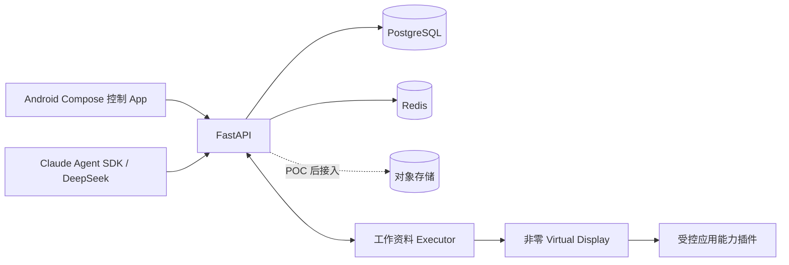

# open-jevis — 同机并行手机 Agent

open-jevis 让用户继续操作物理主屏时，AI 在同一台 Android 手机的隔离空间与非零虚拟显示中执行自然语言任务。它是通用任务执行器，不是邮件专用工具：QQ 邮箱只是首个端到端验证插件，能力注册表同时覆盖日历、微信、浏览器、便签、地图、相册和联系人。系统不会回退到 `Display 0`。



## 本地启动

要求：Docker、Python 3.12+、uv、Android SDK API 36、ADB 和 scrcpy。

```bash
cp .env.example .env
docker compose up -d
cd backend
UV_CACHE_DIR=/tmp/open-jevis-uv-cache uv sync --group dev --extra agent
UV_CACHE_DIR=/tmp/open-jevis-uv-cache uv run uvicorn jevis.main:app --reload
# 另一个终端，仅本地规则；不会上传邮箱 UI
CLAUDE_AGENT_ENABLED=false uv run python -m jevis.services.agent_worker
# 另一个终端
./scripts/start_isolated_display.sh
# 首次或代码变更后
./scripts/deploy_android.sh
```

打开 <http://localhost:8000/docs>。Android Studio 打开 `android/`；模拟器默认访问 `10.0.2.2:8000`，真机开发需把 `API_BASE_URL` 改为电脑局域网地址。执行 `./scripts/probe_device.sh` 可采集已连接 Android 设备的基础能力信息。

## 环境变量

必填项位于 `.env.example`：`DATABASE_URL`、`REDIS_URL` 和 `DEVICE_GATEWAY_TOKEN`。对象存储变量为后续 Trace 上传预留。启用 Agent 时再配置 `DEEPSEEK_API_KEY`、`DEEPSEEK_BASE_URL`、`DEEPSEEK_MODEL` 和 `CLAUDE_AGENT_ENABLED=true`。密钥不得提交。

## 安全边界与当前状态

- 执行器领取任务前必须上报虚拟显示、定向输入和工作资料能力。
- `displayId == 0`、资料用户不匹配、越序事件均被拒绝。
- 目标 App 必须来自后端与手机端一致的能力白名单；发送、发布、提交等外部动作支持批准/拒绝闭环。
- 已完成：基础设施、通用任务 API/事件、设备领取协议、PRD 对齐的 Compose 页面、非零虚拟显示实机验证、Accessibility Executor、观察—规划—动作通道和 Claude Agent SDK 适配层。
- 当前真机阻塞项：用户启用无障碍执行器；随后再配置 DeepSeek 凭据，验证任意自然语言任务与 QQ 邮箱最终发送。

详细设计见 [产品方案](./AI手机并行任务助手产品方案.md)，设备协议见 [Device Gateway](./docs/device-gateway.md)。
