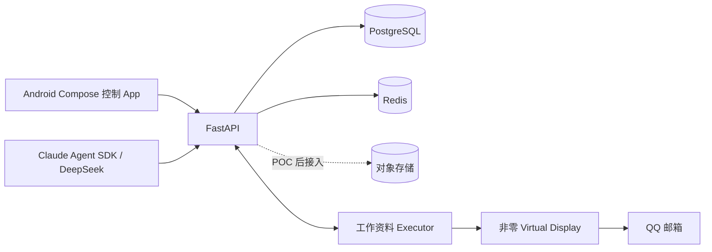

# open-jevis — 同机并行手机 Agent

open-jevis 让用户继续操作物理主屏时，AI 在同一台 Android 手机的工作资料与非零虚拟显示中执行任务。当前 MVP 覆盖任务控制 App、FastAPI 任务平台、设备安全协议和 QQ 邮箱发信任务；小米 15 Ultra 的可信虚拟显示及定向输入仍需实机探针验证，系统不会回退到 `Display 0`。



## 本地启动

要求：Docker、Python 3.12+、uv；Android Studio 用于手机 App。

```bash
cp .env.example .env
docker compose up -d
cd backend
UV_CACHE_DIR=/tmp/open-jevis-uv-cache uv sync --dev
UV_CACHE_DIR=/tmp/open-jevis-uv-cache uv run uvicorn jevis.main:app --reload
```

打开 <http://localhost:8000/docs>。Android Studio 打开 `android/`；模拟器默认访问 `10.0.2.2:8000`，真机开发需把 `API_BASE_URL` 改为电脑局域网地址。执行 `./scripts/probe_device.sh` 可采集已连接 Android 设备的基础能力信息。

## 环境变量

必填项位于 `.env.example`：`DATABASE_URL`、`REDIS_URL` 和 `DEVICE_GATEWAY_TOKEN`。对象存储变量为后续 Trace 上传预留。启用 Agent 时再配置 `DEEPSEEK_API_KEY`、`DEEPSEEK_BASE_URL`、`DEEPSEEK_MODEL` 和 `CLAUDE_AGENT_ENABLED=true`。密钥不得提交。

## 安全边界与当前状态

- 执行器领取任务前必须上报虚拟显示、定向输入和工作资料能力。
- `displayId == 0`、资料用户不匹配、越序事件均被拒绝。
- QQ 邮箱包名限定为 `com.tencent.androidqqmail`，发送任务使用幂等键。
- 已完成：基础设施、任务 API/事件、设备领取协议、Compose 四页面、后端测试。
- 未完成：小米 15 Ultra 实机虚拟显示 Executor、ARTEMIS 适配、模型真实调用、QQ 邮箱端到端发信验证。

详细设计见 [产品方案](./AI手机并行任务助手产品方案.md)，设备协议见 [Device Gateway](./docs/device-gateway.md)。
